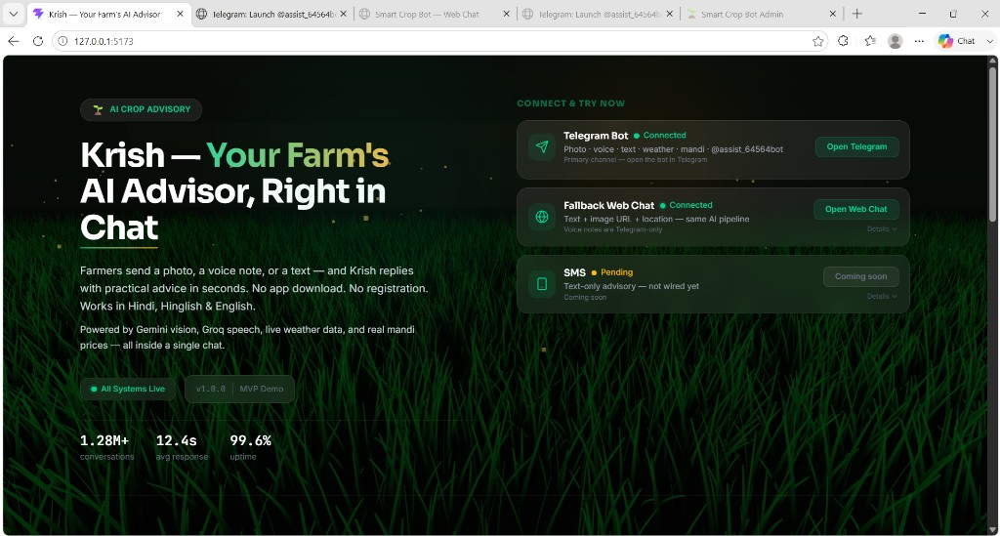
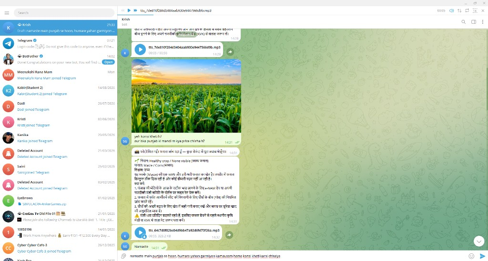
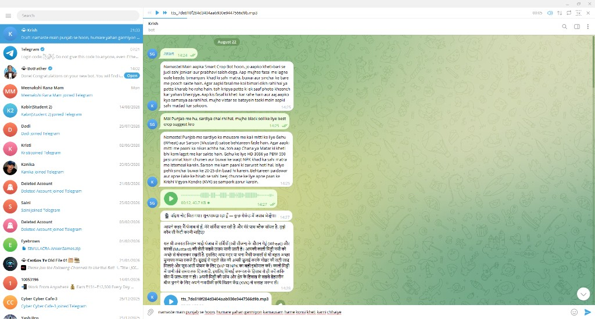
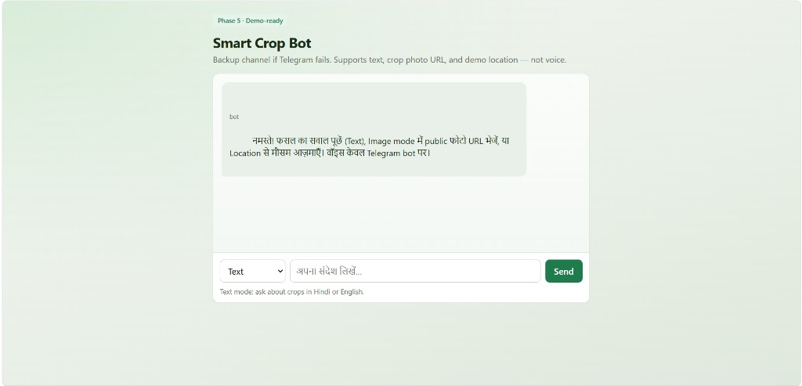
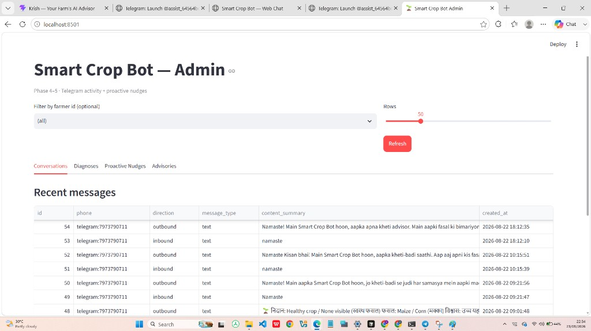
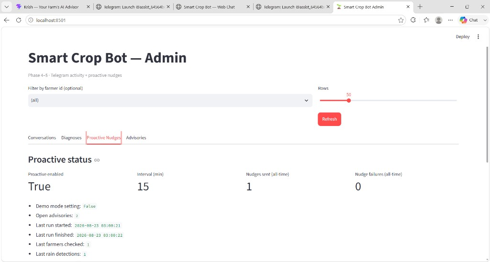

# Krish — Your Farm's AI Advisor, Right in Chat

**OOSC 4.0 · Hackathon MVP · Team Krish**

Indian farmers lose crops to diseases they cannot diagnose in time, and most agri apps never get used — they need a download, a login, and high digital literacy. **Krish** (Smart Crop Bot) puts an AI advisor where farmers already talk: **Telegram**. Send a leaf photo, a Hindi voice note, or a text. Get practical advice in seconds. No app download. No registration.

> Meet farmers on Telegram with vision, voice, and practical Hindi advice — then warn them *before* rain washes off a spray.

| | |
| --- | --- |
| **Primary channel** | Telegram bot [`@assist_64564bot`](https://t.me/assist_64564bot) |
| **Fallback** | Browser Web Chat (`/chat`) — text, image URL, location |
| **Roadmap** | SMS for *proactive* alerts only (not two-way chat) |
| **Languages** | Hindi · Hinglish · English |
| **Status** | Phase 5 demo-ready |

---

## The problem

- Crop disease and pest damage is huge when advice arrives too late.
- Expert help is scarce, expensive, or far away from the field.
- Most agri-tech apps fail rural adoption: install friction, forms, English-only UIs.
- Farmers already live in chat apps. Voice notes are more natural than typing.

**The gap:** a zero-install, photo + voice advisor in the farmer's language — plus a second loop that warns about upcoming weather risk without waiting for the farmer to ask.

## What Krish actually is

Krish is a **conversational agricultural advisor**, not satellite farm monitoring.

| People might assume | What we built |
| --- | --- |
| Continuous satellite / sensor farm watch | No — farmer-initiated chat + scheduled weather checks |
| Automatic pest detection with no input | No — farmer sends a photo, voice, or text |
| Full precision-ag platform | No — practical advisory chatbot |
| Photo diagnosis + Hindi voice in Telegram | **Yes** |
| Unprompted rain caution when an advisory is open | **Yes** (proactive loop) |

---

## Features

| Feature | What the farmer sees |
| --- | --- |
| **Photo diagnosis** | Send a crop/leaf photo → Hindi diagnosis, crop name, confidence, क्या करें steps |
| **Voice in** | Hindi/Hinglish voice note → Groq Whisper transcript → same AI pipeline |
| **Voice out** | Hindi TTS (`edge-tts`) so low-literacy users can *listen* |
| **Text chat** | Crop, weather, and mandi questions in Hindi or English |
| **Weather** | Share location → OpenWeather-backed local advice |
| **Mandi context** | Demo market-price replies for the hackathon |
| **Proactive rain nudge** | If rain is likely in ~24h **and** the farmer has an OPEN advisory → unprompted Hindi caution (delay irrigation/spray) |
| **Admin dashboard** | Streamlit: conversations, diagnoses, nudges, advisories |
| **Web Chat backup** | Same AI if Telegram is down (text / public image URL / location — **no voice**) |

---

## Live product tour

Screens from a working demo, in the order judges usually walk the product.

### 1. Landing — connect and try

React portal at `http://127.0.0.1:5173`. **Open Telegram** launches the bot. **Open Web Chat** is the fallback. SMS is shown as coming soon (last-mile for alerts, not sandbox chat).



### 2. Telegram — photo diagnosis (the wow path)

Farmer sends a maize-field photo. Krish identifies the crop, reports health, and gives actionable next steps (e-NAM / mandi, pest watch, fertilizer) plus a Hindi voice reply.



### 3. Telegram — voice note in, voice advice out

Farmer sends a 12s voice note. Krish transcribes it (“Aapne kaha: …”), answers in Hinglish (e.g. Punjab winter crops: wheat / mustard, seed varieties, irrigation), and returns an `.mp3` so they can listen.



### 4. Fallback Web Chat

If Telegram fails on judging day: same backend at `/chat`. Text, public photo URL, demo location. Voice stays Telegram-only — we say that on the page.



### 5. Admin — conversations (audit trail)

Every inbound/outbound message is logged (`telegram:<chat_id>`). Judges can see the live trail, including structured diagnoses.



### 6. Admin — proactive loop proof

Not a mock badge: **Proactive enabled**, 15-minute interval, open advisories, last run, rain detections, nudges sent. This is the evidence that the second loop ran without the farmer asking.



---

## Architecture

Two loops share one FastAPI brain. The webhook does **not** contain the rain logic.

```
Reactive (farmer asks)
  Farmer → Telegram webhook or /chat
        → FastAPI orchestrator
        → Gemini (vision/chat) / Groq fallback
        → Whisper STT + edge-tts
        → reply on Telegram or Web Chat
        → SQLite log

Proactive (system warns)
  APScheduler (~15 min)
        → farmers with lat/lon
        → OPEN advisory?
        → OpenWeather 5-day / 3-hour forecast (next 24h)
        → Rain ∧ Open-Advisory
        → Hindi nudge via Telegram
        → nudge_events + Streamlit
```

**Nudge rule (explicit):**

```text
Nudge = rain expected in lookahead window  AND  farmer has an OPEN advisory
```

Rain is true if any 3-hour forecast point in the next 24h has:

- `pop >= 0.40`, or
- rain volume `>= 1.0 mm`, or
- weather label Rain / Drizzle / Thunderstorm

Cooldown: 24 hours per farmer so we do not spam.

### Channels — what we learned

Two-way **Twilio WhatsApp/SMS sandbox** was not reliable enough for a live demo (join codes, webhook, number constraints). We did **not** fake that channel.

| Job | Channel today | Why |
| --- | --- | --- |
| Farmer asks (photo / voice / text) | Telegram + Web Chat | Rich media, instant bot, no Meta verification wait |
| System warns without asking | Proactive engine → Telegram now | Decision engine is live; send step is one function |
| Future last-mile alert | **SMS (planned)** | Short caution texts fit feature phones; chat does not need to live on SMS |

The SMS card on the landing page is intentionally **pending** — honest UI, not a broken Twilio demo.

---

## Tech stack

Free-tier capable for a hackathon weekend.

| Layer | Choice |
| --- | --- |
| Landing | React + Vite + Tailwind (`frontend/`) |
| Channel | Telegram Bot API · Web Chat Jinja UI |
| Backend | Python + FastAPI + Uvicorn |
| Vision / chat | Gemini 3.6 Flash → Groq Llama / GPT-OSS fallback |
| STT | Groq Whisper `whisper-large-v3` |
| TTS | `edge-tts` (`hi-IN-SwaraNeural`) |
| Weather | OpenWeather 5-day / 3-hour forecast |
| Scheduler | APScheduler |
| Data | SQLite (`data/smart_crop_bot.db`) |
| Admin | Streamlit (`admin/streamlit_app.py`) |
| Tunnel | Cloudflare (`cloudflared`) for Telegram webhooks |
| Deploy | Render / Railway configs included |

---

## Quick start (Windows)

Need **two** processes: API on `:8000` and frontend on `:5173`. Use `python -m` (venv `.exe` launchers may still point at an old `C:\Krishi` path).

### 1. Backend

```bat
cd /d c:\krishi-second
python -m venv .venv
.venv\Scripts\python.exe -m pip install -r requirements.txt
copy .env.example .env
```

Fill `.env`: `TELEGRAM_BOT_TOKEN`, `GEMINI_API_KEY`, `GROQ_API_KEY`, `OPENWEATHER_API_KEY`, `APP_PUBLIC_URL`.

```bat
.venv\Scripts\python.exe -m uvicorn app.main:app --reload --host 0.0.0.0 --port 8000
```

### 2. Public HTTPS for Telegram (second terminal)

```bat
npx --yes cloudflared tunnel --url http://127.0.0.1:8000
```

Put the `https://….trycloudflare.com` URL in `APP_PUBLIC_URL`, restart uvicorn, then:

```powershell
curl.exe -X POST http://127.0.0.1:8000/webhooks/telegram/set-webhook
```

### 3. Landing (third terminal)

```bat
cd /d c:\krishi-second\frontend
npm install
npm run dev
```

### URLs

| Surface | URL |
| --- | --- |
| **Landing (submit / demo this)** | http://127.0.0.1:5173 |
| API health | http://127.0.0.1:8000/health |
| Demo checklist | http://127.0.0.1:8000/demo/checklist |
| Web Chat | http://127.0.0.1:8000/chat or http://127.0.0.1:5173/chat |
| Admin | http://localhost:8501 |

Admin:

```bat
cd /d c:\krishi-second
.venv\Scripts\python.exe -m streamlit run admin\streamlit_app.py --server.port 8501
```

Pre-warm models before a live pitch:

```bat
.venv\Scripts\python.exe scripts\prewarm.py --base http://127.0.0.1:8000
```

---

## Judge demo (~90 seconds)

1. Landing → **Open Telegram**.
2. Send a **diseased leaf / crop photo** → point at diagnosis + क्या करें (~8–15s).
3. Send a **Hindi voice note** → show transcript + TTS.
4. Share **location** → `आज मौसम कैसा है?`
5. Ask mandi: `टमाटर का मंडी भाव?` (demo prices — say so).
6. Admin → **Conversations**.
7. Proof of proactive loop (do not wait 15 minutes):

```bat
.venv\Scripts\python.exe scripts\seed_advisory.py --list-farmers
.venv\Scripts\python.exe scripts\seed_advisory.py --farmer-id telegram:YOUR_CHAT_ID
.venv\Scripts\python.exe scripts\test_proactive.py --farmer-id telegram:YOUR_CHAT_ID --force-rain
```

Phone gets an **unprompted** Hindi rain caution (`[DEMO MODE]` if rain is forced). Refresh **Proactive Nudges**. Say clearly: `--force-rain` is for judging when the sky is dry; production uses real OpenWeather.

If Telegram dies: open `/chat` and continue with text + image URL.

---

## Project layout

```text
app/                 FastAPI app, webhooks, webchat, services
  services/proactive.py   Rain ∧ open-advisory nudge
  services/forecast.py    OpenWeather rain rule
  services/scheduler.py   APScheduler lifespan
  webhooks/telegram.py    Inbound Telegram
admin/               Streamlit dashboard
frontend/            React landing + channel connector
scripts/             prewarm, seed advisory, test_proactive
docs/                PRD, workflow, phase notes, screenshots
```

More detail: [Product idea](docs/01_Product_Idea.md) · [Tech stack](docs/02_Tech_Stack.md) · [Workflow](docs/03_Application_Workflow.md) · [PRD](docs/04_PRD.md) · [Proactive loop](docs/PROACTIVE_LOOP_YOUR_STEPS.md) · [Demo script](docs/DEMO_SCRIPT.md)

---

## Environment (no secrets in git)

See [`.env.example`](.env.example). Never commit `.env`.

| Variable | Purpose |
| --- | --- |
| `TELEGRAM_BOT_TOKEN` | BotFather token |
| `TELEGRAM_BOT_USERNAME` | Optional `@` handle for `t.me` deep link |
| `APP_PUBLIC_URL` | HTTPS tunnel / Render URL for webhook |
| `GEMINI_API_KEY` / `GROQ_API_KEY` | Vision, chat, STT |
| `OPENWEATHER_API_KEY` | Weather + proactive forecast |
| `PROACTIVE_ENABLED` | Default `true` |
| `PROACTIVE_DEMO_MODE` | Treat rain as true for staged demos |

---

## Scope lock (honesty for judges)

- Mandi prices in the MVP are **demo / sample**, not a live national feed.
- Proactive alerts today are **rain × open advisory**, not frost / pest / price crash (roadmap).
- SMS send is **not wired**; the engine and Telegram delivery are.
- Landing hero numbers (conversations / uptime) are **product-page metrics**, not a production SLA.

---

## License

Hackathon demonstration project · Team Krish · 2026
